# ROCK-PAPER-SCISSORS-LIZARD-SPOCK

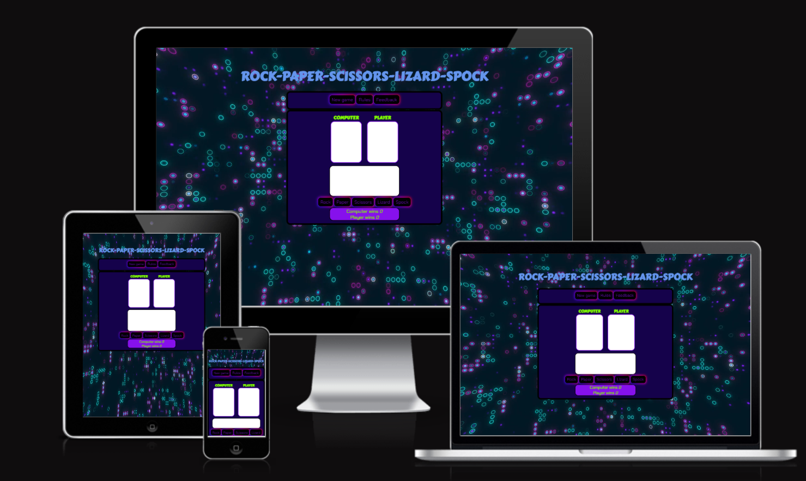

Rock Paper Scissors Lizard Spock (RPSLS) is an extension of the classic game, Rock Paper Scissors, created by Sam Kass and Karen Bryla and first shown on TV on the American sitcom *The Big Bang Theory* when Raj and Sheldon decided to solve a disput using this game. 

On this website you can enjoy this game and play it against the computer, with a very simple user interface that takes care of all the details of the game.

Visit the deployed website [here](https://miguelsanleon.github.io/Rock-Paper-Scissors-Lizard-Spock/).

## Table of Contents

- [ROCK-PAPER-SCISSORS-LIZARD-SPOCK](#rock-paper-scissors-lizard-spock)
  - [Table of Contents](#table-of-contents)
  - [User Experience (UX)](#user-experience-ux)
    - [Project Goals](#project-goals)
    - [User Stories](#user-stories)
    - [Color Scheme](#color-scheme)
    - [Typography](#typography)
    - [Wireframes](#wireframes)
  - [Features](#features)
    - [General](#general)
    - [Home Section](#home-section)
    - [Rules Section](#rules-section)
    - [Feedback Section](#feedback-section)
    - [Game section](#game-section)
    - [Error Page](#error-page)
  - [Technologies Used](#technologies-used)
    - [Languages Used](#languages-used)
    - [Frameworks, Libraries and Programs Used](#frameworks-libraries-and-programs-used)
  - [Testing](#testing)
    - [Testing User Stories](#testing-user-stories)
    - [Accessibility](#accessibility)
    - [Tools Testing](#tools-testing)
    - [Manual Testing](#manual-testing)
  - [Deployment](#deployment)
    - [GitHub Pages](#github-pages)
  - [Credits](#credits)
    - [Content](#content)
    - [Media](#media)
    - [Code](#code)
  - [Acknowledgements](#acknowledgements)

***

## User Experience (UX)

### Project Goals

* The website has an easy to navigate structure.

* The color scheme is consistent with the background video.

* Responsive design that allows a correct display of the website on multiple devices

* The interactivity of the website offers a complete user experience.

* The rules section provides all the necessary information about the game and how to play it, as well as a table of results to understand how to beat the computer.

* There is also a feedback section that allows the user to leave comments or their opinion about the game.

### User Stories

* As a player, I would like the game's website to be easy to navigate and understand.

* As a player, I would love to have fun playing the game.

* As a player, I would like to have a complete explanation of the game rules.

* As a player, I would like the game controls to be easy to use.

* As a player, I would like to know about the score and each round winner at any moment during the gameplay.

* As a player, I would like to be able to play the game on different devices.

### Color Scheme

| Color             | Hex                                                                |
| ----------------- | ------------------------------------------------------------------ |
| Example Color |  #15024b |
| Example Color |  #8611ec|
| Example Color |  #6495ed |
| Example Color |  #7fff00 |
| Example Color |  #ffffff |

The colors used in the site are white  (#ffffff) for some backgrounds, a (#15024b) for game container, navigation bar and errorpage container backgrounds, a (#8611ec) for score table background, a (#6495ed) for game title and rules boxes and feedback background and (#7fff00) score table text and computer and player titles.

The colors scheme is inspired it the background video adding a yellow for a good title and text contrast.

### Typography

The main font used in the site is Chakra Petch, used with Carter One for the titles , with Sans Serif as the fallback font for both.

### Wireframes

[Balsamiq](https://balsamiq.com/) has been used to showcase the appearance of the site and display the placement of the different elements whitin the pages.

Page | Wireframe
--- | ---
landing page | 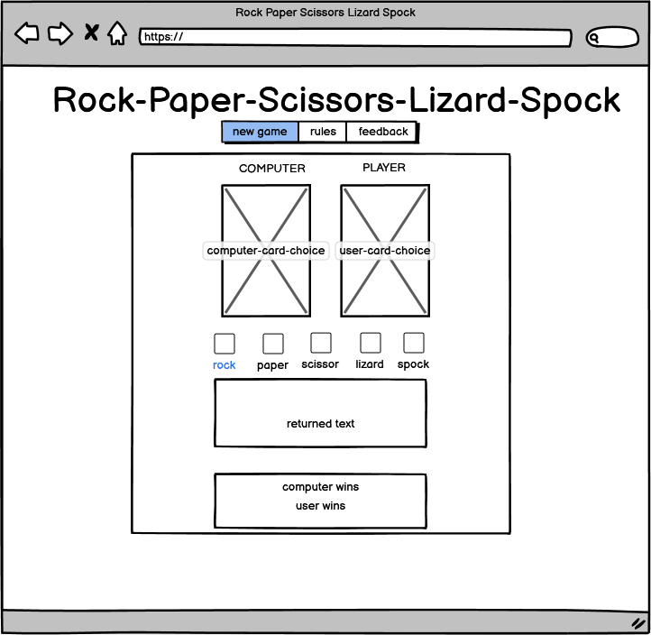
Rules section | 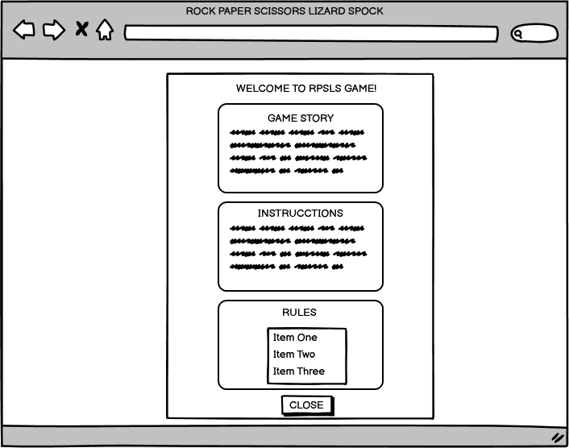
feedback section| 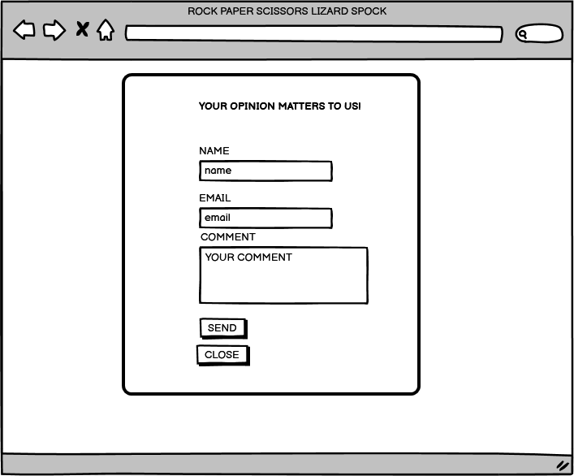
error page | 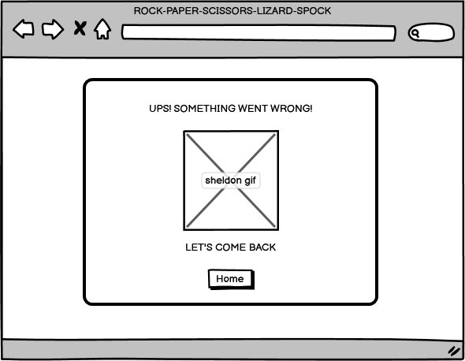

[Back to top ⇧](#rock-paper-scissors-lizard-spock)

## Features

### General

* The website has been designed using clamp function to have a better responsiveness.

* **Header**
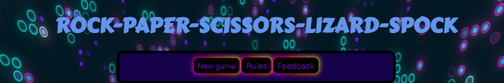

    - The header contains the game title in Carter One fonts and the navigation bar.

    - The navigation bar contains links to rules and feedback sections to facilitate navigation across the site. It also has a hover effect that changes color to provide feedback to the player for a better user experience.

* **Game section**

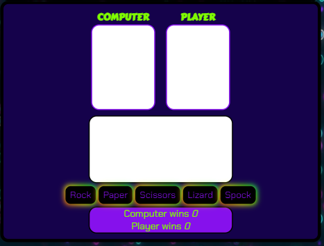

- The game section contains the titles "computer" and "player" on top of the slots for the game cards, the item selection buttons for the player, a text box for the game results and finally a scoreboard that is updated after each round. 
- The card slots shows the computer and player selection respectively.
- The buttons section shows the 5 different choices the player has.
- The result text box show who wins the round and why the winner card beats the other one. When one of the players wins 5 round, the result box shows who wins and the text "GAME OVER!".
- the scoreboard shows at all times how many rounds the computer and the player have won at all times.

* **Background**

- To obtain a background that is always in motion, a background video in loop mode has been added.

### Home Section
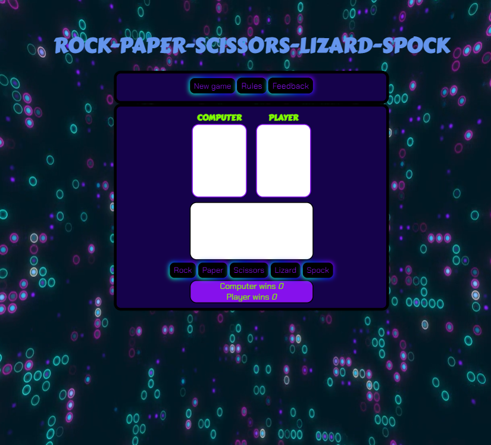

* **Title**
    - The title is on top of the home section centered and fully responsive.

* **Navigation Buttons**
    - The New game button starts the game showing the game logo in both card slots and activates the player buttons section. In the result section the player can read "Make your choice with the buttons!"
    - The rules button opens the rules section.

    - The feedback button open the feedback popup.

### Rules Section
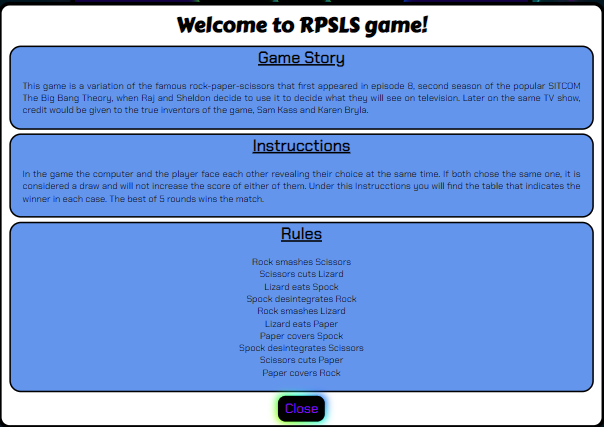

* The Rules section has 3 parts, the game story, the instrucctions and the rules, providing all the information to players.

### Feedback Section
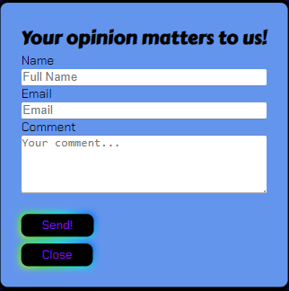

* The feedback section is a simple form that consists of three fields, name, email and comments. just below that, players can find a button to send the content of the form and another button to exit if the player do not want to fill in the form.
* 
### Game section
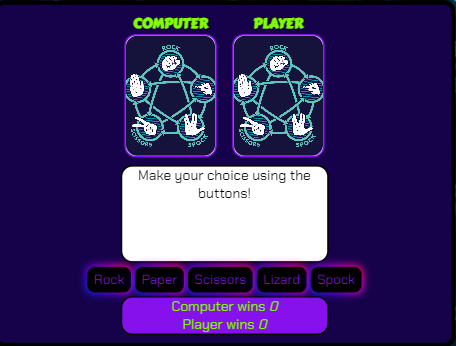

* **Cards Section**
    - Display item chosen by the computer and the player on each round using and image

* **Result Section**
    - Shows the result of each round and the reason why the winner beats the loser

* **Game Buttons**
    - Allow the player to select the item to be used in the next round.
  - 
* **Scoreboard**
    - Shows the number of rounds each player has win before the end of the game. When one of the players wins 5 round, the scoreboard is reset to 0.

### Error Page
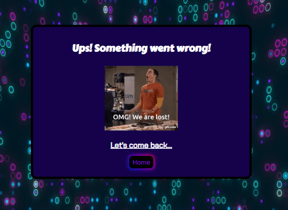

*  This single page is being shown when the player push the send button on the feedback section. It has a button to come back to the landing page.

[Back to top ⇧](#rock-paper-scissors-lizard-spock)

## Technologies Used

### Languages Used
* [HTML5](https://en.wikipedia.org/wiki/HTML5)
* [CSS3](https://en.wikipedia.org/wiki/CSS)
* [Javascript](https://en.wikipedia.org/wiki/JavaScript)

### Frameworks, Libraries and Programs Used

* [Google Fonts](https://fonts.google.com/)
    - Google Fonts was used to import the fonts Carter One and Chakra Petch into the style.css file. These fonts were used throughout the site.

* [Codeanywhere](https://app.codeanywhere.com/)
     - Codeanywhere was used for writing code, committing, and then pushing to GitHub.

* [GitHub](https://github.com/)
     - GitHub was used to store the project after pushing.

* [Balsamiq](https://balsamiq.com/)
     - Balsamiq was used to create the wireframes during the design phase of the project.

* [Am I Responsive?](http://ami.responsivedesign.is/#)
    - Am I Responsive was used in order to see responsive design throughout the process and to generate mockup imagery to be used.

* [Responsive Design Checker](https://www.responsivedesignchecker.com/)
    - Responsive Design Checker was used in the testing process to check responsiveness on various devices.

* [Chrome DevTools](https://developer.chrome.com/docs/devtools/)
    - Chrome DevTools was used during development process for code review and to test responsiveness.

* [W3C Markup Validator](https://validator.w3.org/)
    - W3C Markup Validator was used to validate the HTML code.

* [W3C CSS Validator](https://jigsaw.w3.org/css-validator/)
    - W3C CSS Validator was used to validate the CSS code.

* [JSHint](https://jshint.com/) 
    - The JSHints JavaScript Code Quality Tool was used to validate the site's JavaScript code.

* [Favicon.cc](https://www.favicon.cc/) 
    - Favicon.cc was used to create the site favicon.

[Back to top ⇧](#rock-paper-scissors-lizard-spock)

## Testing

### Testing User Stories

 * As a player, I would like the game's website to be easy to navigate and understand.

    - The navigation bar allows the player to navigate through all sections.
    - The player can come back from any page or section in the web to the landing page.
    - A popup system has been implemented to have a better navigation on the page.
  
* As a player, I would love to have fun playing the game.

    - The game use images to show the computer and player choice and has a result section that offers feedback of the game status at all times.
    - The error page shows a funny gif to enjoy even the most bitter situation.
    - In the Rules section players can find a game story section that describes the reason why this game became known.

* As a player, I would like to have a complete explanation of the game rules.

    - The rules secttion offers 2 section that have easy instrucctions to understand the game logic.

* As a player, I would like the game controls to be easy to use.

    - The button section in the game section allows the player to make a choice to play the game each round.
    - The navigation bar is easy to use and undestand to navigate through the web.
* As a player, I would like to know about the score and each round winner at any moment during the gameplay.
    
    - The scoreboard section allways shows the game score.

* As a player, I would like to be able to play the game on different devices.

    - The web is fully responsive in all devices and it has a landscape view block for a better responsiveness.

    ### Code Validation

* The [W3C Markup Validator](https://validator.w3.org/) and [W3C CSS Validator](https://jigsaw.w3.org/css-validator/) services were used to validate all pages of the project in order to ensure there were no syntax errors.

    - W3C Markup Validator found no erros or warnings on index.html
    - W3C Markup Validator found no erros or warnings on errorpage.html
  
    -  W3C CSS Validator found an error on line 229 padding-top, to many values or values not recognized.
    -  W3C CSS Validator also shows 5 warnings:
        -2	 Imported style sheets are not checked in direct input and file upload modes
       - 82	 webkit-user-select is a vendor extension
       - 106 webkit-filter is a vendor extension
       - 335 webkit-user-select is a vendor extension
       - 358 webkit-filter is a vendor extension

* The [JSHints JavaScript Code Quality Tool](https://jshint.com/) was used validate the site's JavaScript code.

    - JSHints found 8 warnings:
        - 86	Unnecessary semicolon.
        - 86	Expected a 'break' statement before 'case'.
        - 92	Unnecessary semicolon.
        - 92	Expected a 'break' statement before 'case'.
        - 98	Unnecessary semicolon.
        - 98	Expected a 'break' statement before 'case'.
        - 104	Unnecessary semicolon.
        - 104	Expected a 'break' statement before 'case'.

### Accessibility

** Used Lighthouse in Chrome DevTools to check performance, accesibility, best practices and SEO

* Lighthouse reports

    - **index.html**

    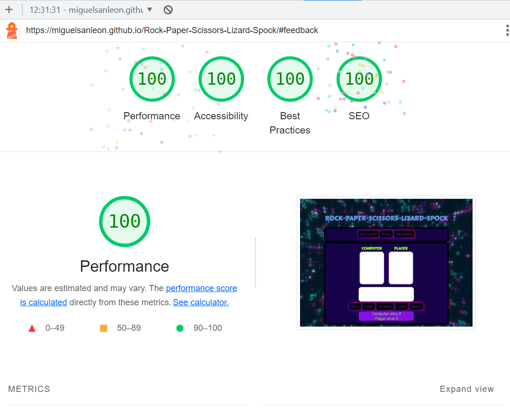

    - **errorpage.html**

    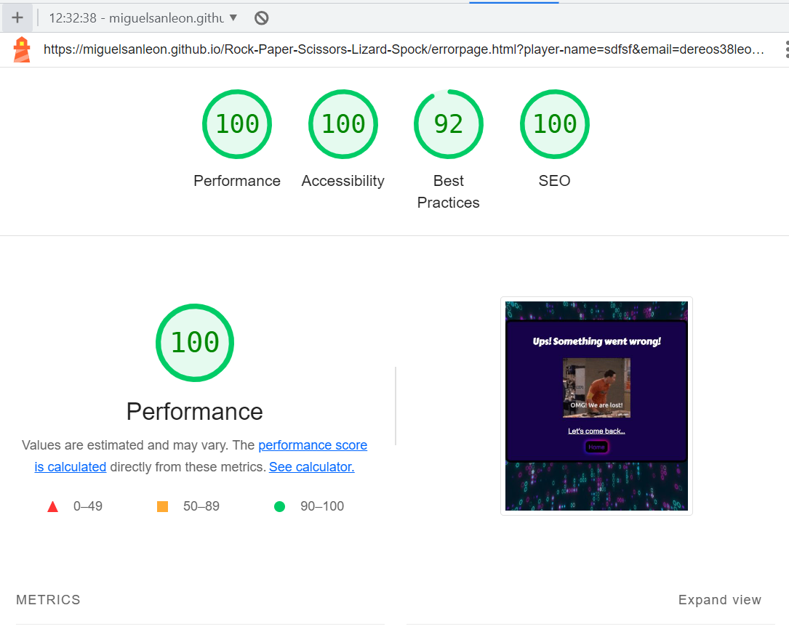

### Tools Testing

* [Chrome DevTools](https://developer.chrome.com/docs/devtools/)

    - Chrome DevTools was used during the development process to check css style, modify html anc css and improve the website view.

* Responsiveness

    - [Am I Responsive?](http://ami.responsivedesign.is/#) was used to check responsiveness of the site pages using different devices.

    - [Responsive Design Checker](https://www.responsivedesignchecker.com/) was used to check responsiveness of the site pages on different screen sizes.

    - Chrome DevTools was used to test responsiveness in different screen sizes during the development process.

### Manual Testing

* Browser Compatibility 

[lambdatest](https://www.lambdatest.com/?utm_source=Guru99) was used to check responsiveness in different browsers.

Browser | Outcome | Pass/Fail  
--- | --- | ---
Google Chrome | No appearance, responsiveness nor functionality issues.| Pass
Safari | No appearance, responsiveness nor functionality issues.
Microsoft Edge | No appearance, responsiveness nor functionality issues. | Pass

* Device compatibility

Device | Outcome | Pass/Fail
--- | --- | ---
MacBook Pro 15" | No appearance, responsiveness nor functionality issues. | Pass
Nexus 7| No appearance, responsiveness nor functionality issues. | Pass
iPad Pro 12.9" | No appearance, responsiveness nor functionality issues. | Pass
iPad Pro 10.5" | No appearance, responsiveness nor functionality issues. | Pass
iPhone XR | No appearance, responsiveness nor functionality issues. | Pass
iPhone 7 | No appearance, responsiveness nor functionality issues. | Pass

* Common Elements Testing

    - General

    Feature | Outcome | Pass/Fail
    --- | --- | ---
    Navigation Bar | Hover effect is not doing the trasition as expected. Links are working as expected. | Fail
    Landscape Orientation Blocker | when device is turned to landscape orientation the screen show vertical orientation | Pass

    - Landing Section
    
    Feature | Outcome | Pass/Fail
    --- | --- | ---
    New Game Button | Hover effect not doing the transition. Start the game showing the logo in card section when button is clicked, work as expected. | Pass
    Rules button | Hover effect not doing the transition ok. Rules popup is shown when button is clicked | Pass
    Feedback Button | Hover effect not doing transition as expected. Buttomn opens feedback form popup when clicked. | Pass
    
    ** The problems with the transition in the buttons did not occur until the last commits, the developer will try to solve it after the delivery date due to lack of time.**
    
    - Feedback Form Popup
    
    Feature | Outcome | Pass/Fail
    --- | --- | ---
    Form | Require all fields in the right format before submission. |  Pass
    Send Feedback Button | Hover effect not doing transitions as expected. Submit form when cicked and shows errorpage as expected |  Pass
    Close Button | Hover effect not doing transitions as expected. Close popup when clicked. | Pass

    - Game Section

    Feature | Outcome | Pass/Fail
    --- | --- | ---

    Computer Card | Display the image of the item generated by the computer. | Pass
    Plater Card | Display the image of the item chosen by the player. | Pass
    Result Section | Display the expected text depending on the round result. | Pass
    Game Buttons | Clicking on each button select the correct item. | Pass
    Computer Score | Display the total rounds wins by computer | Pass
    Plater Score | Display the total rounds wins by the Player | Pass

    - Error Page

    Feature | Outcome | Pass/Fail
    --- | --- | ---
    Error page | When the player send the form is redirected to error page. | Pass
    Home Button |link to home section when button is clicked work as expected. | Pass

[Back to top ⇧](#rock-paper-scissors-lizard-spock)

## Deployment

- This website was developed using [Codeanywhere](https://app.codeanywhere.com/), which was then committed and pushed to GitHub.

### GitHub Pages

* Here are the steps to deploy this website to GitHub Pages from its GitHub repository:

    1. Log in to GitHub and locate the [GitHub Repository](https://github.com/).

    2. At the top of the Repository, locate the Settings button on the menu.

    3. Scroll down the Settings page until you locate the Pages section. It can be display in a separate bar in the left of the screen.

    4. Under Source, click the dropdown called None and select Master/Main Branch.

    5. The page will refresh automatically and generate a link to your website.

[Back to top ⇧](#rock-paper-scissors-lizard-spock)

## Credits

### Content

* The instructions and rules were taken from the [Hobbyconsolas](https://www.hobbyconsolas.com/reportajes/curiosa-historia-mitico-piedra-papel-tijeras-lagarto-spock-sheldon-big-bang-theory-707343).

### Media

- The logo image used as Card was taken from [StackExchange](https://codegolf.stackexchange.com/questions/195083/cheat-at-rock-paper-scissors-lizard-spock)
- The rock image used as Card was taken from [Pexel](https://www.pexels.com/photo/black-stone-2363901/). Thanks to Peter Dopper.
- The scissors image used as Card was taken from [Pexel](https://www.pexels.com/photo/black-scissors-placed-on-beige-background-4226896/). Thanks to Carolia Grabowska.
- The paper image used as Card was taken from [Pexel](https://www.pexels.com/photo/surface-of-crumpled-brown-thick-paper-7794422/). Thanks to Montsera.
- The Lizard image used as Card was generated by [Dream](https://dream.ai/)
- The Spock image used as Card was generated by [Dream](https://dream.ai/)

- The GIF used in the error page was taken from [Tenor](https://tenor.com/search/sheldon-cooper-gifs).

* The background video was taken from [Pexels](https://www.pexels.com/video/digital-animation-of-luminous-dots-and-circles-13427640/). Thanks to Motionmade.net.

### Code

* [Stack Overflow](https://stackoverflow.com/), [CSS-Tricks](https://css-tricks.com/) and [W3Schools](https://www.w3schools.com/) were consulted for the developing process and to get some useful information for desing.

* The code for the popups was made using a youtube video tutorial [Youtube](https://www.youtube.com/watch?v=ZMhEVSvSwwk)

* The orientation landscape block was taken from [CSS-Tricks](https://css-tricks.com/snippets/css/orientation-lock/)

[Back to top ⇧](#rock-paper-scissors-lizard-spock)

## Acknowledgements

* My family, for their support and patience during the design and development process.

* My tutor, Marcel, for all his guidance, comments and constructives ideas for the project.

* Jose Sanchez, he inspired me with his rpsls project in some important ideas for the design

* Code Institute and Slack community that are always to support and help every step of the process.

[Back to top ⇧](#rock-paper-scissors-lizard-spock)